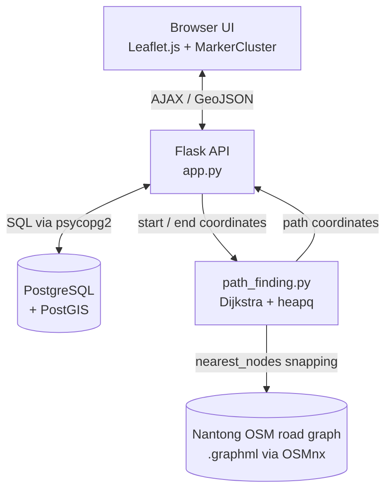

<div align="center">

# 🗺️ WebGIS-Place-Manager

### Full-stack WebGIS platform for place-name management & real-road-network Dijkstra routing
### 基于 Flask + PostGIS + Leaflet 的全栈地名管理与真实路网最短路径规划系统

[](https://www.python.org/)
[](https://flask.palletsprojects.com/)
[](https://postgis.net/)
[](https://leafletjs.com/)
[](./LICENSE)
[](https://github.com/TPC369max/WebGIS-Place-Manager/stargazers)

</div>

---

## Preview 效果预览


*Thousands of place markers clustered with `Leaflet.markercluster` 海量地名点位聚合展示*


*Shortest path computed on Nantong's real OSM road network 基于南通真实路网计算的最短路径*

> 📖 A full write-up of the build process is on the author's blog: [从零构建全栈 WebGIS 系统](https://809570.xyz/2025/06/05/WebGIS-Place-Manager/)

---

## Overview 项目简介

**WebGIS-Place-Manager** is a full-stack, B/S (Browser/Server) geographic information system for managing place-name data and planning routes on a real road network. Every layer was built independently — the spatial database schema, the Flask REST API, and the Leaflet-based front-end — rather than wrapping a third-party map SDK, with the goal of actually owning the full geospatial pipeline: from PostGIS storage, through GeoJSON serialization, to a hand-written Dijkstra router running on a real OpenStreetMap graph.

**WebGIS-Place-Manager** 是一个基于 B/S（浏览器/服务器）架构的全栈地理信息系统，用于地名数据管理与真实路网上的最短路径规划。项目的空间数据库设计、Flask 后端 REST API、以及 Leaflet 前端交互均为独立开发，而非简单封装第三方地图 SDK —— 目标是真正打通从 PostGIS 空间存储、GeoJSON 序列化，到基于真实 OpenStreetMap 路网、手写 Dijkstra 路由算法的完整地理空间数据链路。

---

## ✨ Key Features 核心功能

- **Full CRUD for place-name records** — add, edit, delete, and search places by name or ID, kept in sync between the data table and the map in real time. 地名数据的增删改查，数据表与地图标记实时双向同步。
- **Massive-marker clustering** — thousands of place points are grouped with `Leaflet.markercluster` so panning and zooming stay smooth. 使用 `Leaflet.markercluster` 对海量地名点聚合展示，保障地图缩放平移的流畅体验。
- **Multiple basemaps** — switch between Esri, Bing, and AutoNavi (高德) tile layers via `Leaflet.ChineseTmsProviders`. 通过 `Leaflet.ChineseTmsProviders` 支持 Esri、Bing、高德等多种底图切换。
- **Administrative boundary overlay** — Jiangsu province polygons are served straight out of PostGIS as GeoJSON. 江苏省行政区划面数据由 PostGIS 直接输出 GeoJSON 并渲染。
- **Real-road-network route planning** — click two points on the map to get the shortest driving path, computed with a hand-written Dijkstra algorithm over an OpenStreetMap graph of Nantong. 在地图上点选两点，基于南通市真实 OSM 路网、手写 Dijkstra 算法计算最短驾车路径。
- **CORS-enabled REST API** — a clean Flask API layer decouples the static front-end from data access and routing logic. 基于 Flask 的 RESTful API 并启用 CORS，前端与数据/路径逻辑职责分离清晰。

---

## 🏗️ Architecture 系统架构



The front-end never talks to the database directly — every read/write goes through the Flask API, which either queries PostGIS (`access_DB.py`) or runs the routing engine (`path_finding.py`) and returns JSON/GeoJSON.

前端从不直接访问数据库，所有读写都经过 Flask API：由 `access_DB.py` 查询 PostGIS，或由 `path_finding.py` 运行路径规划引擎，统一以 JSON / GeoJSON 格式返回。

---

## 🧰 Tech Stack 技术栈

| Layer 层 | Technology 技术 |
|---|---|
| Frontend 前端 | HTML5 / CSS3 / vanilla JavaScript · Leaflet.js + MarkerCluster, Control.FullScreen, ChineseTmsProviders |
| Backend 后端 | Python 3 · Flask · Flask-CORS (RESTful JSON API) |
| Database 数据库 | PostgreSQL + PostGIS · `ST_AsGeoJSON` / `ST_GeomFromGeoJSON` for spatial I/O |
| Path Planning 路径规划 | OSMnx (road graph extraction) · NetworkX (graph structure) · hand-written Dijkstra (`heapq`) |
| Dev Environment 开发环境 | Python `venv`, cross-platform |

---

## 📁 Project Structure 项目结构

```text
WebGIS-Place-Manager/
├── BackEnd/
│   ├── app.py                    # Flask entry point & REST API routes
│   ├── access_DB.py              # PostGIS data access layer (CRUD + GeoJSON)
│   ├── path_finding.py           # Dijkstra shortest-path engine
│   ├── download_road_network.py  # One-off script: fetch & cache the OSM road graph
│   ├── import_JSgeoJSON.py       # One-off script: import Jiangsu boundary GeoJSON into PostGIS
│   ├── poi_data.py               # Helper: fetch POI data from the AutoNavi (高德) API
│   ├── test.py                   # Helper: fetch administrative-district data from the AutoNavi API
│   └── requirements.txt
├── FrontEnd/
│   ├── Nexus.html                # Main SPA shell (served at `/`)
│   ├── script.js                 # App logic: navigation, CRUD table, pagination
│   ├── L_map.js                  # Leaflet map init, base layers, marker sync
│   ├── path_planning.js          # Start/end point picking, route rendering
│   ├── style.css
│   └── leaflet/                  # Vendored Leaflet core + plugins
├── 222.pdf                       # Original design report (functional module diagram)
├── LICENSE                       # MIT
└── README.md
```

> `FrontEnd/index.html` and `else.js` are an early prototype from before the app settled on `Nexus.html`; kept for reference but not part of the running app.
> `FrontEnd/index.html` 与 `else.js` 是早期原型遗留文件，实际运行入口是 `Nexus.html`，两者仅作历史参考保留。

---

## 🚀 Getting Started 快速开始

### Prerequisites 前置条件
- Python 3.9+
- PostgreSQL with the **PostGIS** extension enabled
- pip / venv

### 1. Clone 克隆仓库
```bash
git clone https://github.com/TPC369max/WebGIS-Place-Manager.git
cd WebGIS-Place-Manager/BackEnd
```

### 2. Set up the environment 配置环境
```bash
python -m venv venv
source venv/bin/activate      # Windows: venv\Scripts\activate

pip install -r requirements.txt
# requirements.txt only pins Flask + Flask-CORS — the DB/routing layers also need:
pip install psycopg2-binary networkx osmnx requests
```

### 3. Configure the database 配置数据库
Create a PostGIS-enabled database and point `access_DB.py` at it:
```python
DATABASE_URL = "postgresql://<user>:<password>@localhost:5432/postgis_info"
```
Based on the queries in `access_DB.py`, the code expects at least these two tables (adjust to your actual schema if it differs):
```sql
CREATE EXTENSION IF NOT EXISTS postgis;

CREATE TABLE public.jsplaces (
    "Oid"     TEXT PRIMARY KEY,
    name      TEXT,
    "PlaceLv" TEXT,
    geom      geometry(Point, 4326)
);

CREATE TABLE public.js_geojson (
    name          TEXT,
    shape_length  DOUBLE PRECISION,
    shape_area    DOUBLE PRECISION,
    geom          geometry(Geometry, 4326)
);
```
Then load the Jiangsu boundary data:
```bash
python import_JSgeoJSON.py
```

### 4. Prepare the road network 准备路网数据
```bash
python download_road_network.py
```
This fetches Nantong's drivable OSM network via OSMnx and caches it as `Nantong_road_network.graphml`, which `path_finding.py` loads at request time.

### 5. Run 启动服务
```bash
python app.py
```
Visit **http://127.0.0.1:5000/** 🎉

---

## 🔌 API Reference 接口说明

| Method | Endpoint | Description 说明 |
|---|---|---|
| GET | `/` | Serves the SPA shell, `Nexus.html` |
| POST | `/data_from_postgis` | Returns all place records as JSON 获取全部地名数据 |
| GET | `/js_polygon_data` | Returns the Jiangsu boundary as a GeoJSON `FeatureCollection` 获取江苏省行政区划面数据 |
| POST | `/add_place_data` | Inserts a new place record 新增地名数据 |
| POST | `/update_place_data` | Updates an existing record by `Oid` 按 Oid 修改地名数据 |
| POST | `/delete_place_data` | Bulk-deletes records by a list of `Oid`s 按 Oid 列表批量删除 |
| POST | `/plan_path` | Computes the Dijkstra shortest path between two coordinates 计算两点间的 Dijkstra 最短路径 |

---

## 🧠 Algorithm Highlight: Dijkstra on a Real Road Network 算法亮点

Route planning doesn't call a third-party routing API — it walks a real OpenStreetMap road graph with a Dijkstra implementation written from scratch.

路径规划没有调用第三方路径 API，而是基于真实的 OpenStreetMap 路网图，从零手写 Dijkstra 算法完成计算。

1. **Graph extraction 路网提取** — `download_road_network.py` uses OSMnx to pull Nantong's drivable road network and caches it as a `.graphml` file: intersections become nodes, road segments become edges weighted by length.
   `download_road_network.py` 通过 OSMnx 拉取南通市可驾驶路网并缓存为 `.graphml` 文件，交叉口抽象为节点、道路抽象为带长度权重的边。
2. **Node snapping 坐标捕捉** — a user's map click is an arbitrary lat/lon, so `ox.distance.nearest_nodes` snaps it to the closest real graph node before the search begins.
   用户点击的是任意经纬度坐标，通过 `ox.distance.nearest_nodes` 将其吸附到最近的真实路网节点。
3. **Shortest-path search 最短路径求解** — `path_finding.py` implements Dijkstra with a `heapq`-based priority queue and a `predecessors` map for backtracking, rather than calling `nx.shortest_path` directly.
   `path_finding.py` 使用 `heapq` 优先队列手写 Dijkstra，并用前驱字典回溯路径，而非直接调用 `nx.shortest_path`。
4. **Rendering 前端绘制** — the resulting node sequence is converted to `[lon, lat]` pairs and drawn on the map with `L.polyline`.
   结果节点序列被转换为经纬度坐标串，前端使用 `L.polyline` 绘制在地图上。

---

## 🧭 Roadmap 未来规划

- [ ] User accounts & role-based permissions (admin vs. read-only), as scoped in the original project proposal 用户账号与管理员/普通用户权限体系（源自最初的立项设计）
- [ ] Edit-history logging for place records 地名修改历史记录
- [ ] Batch import / export of place data 批量数据导入导出
- [ ] Containerized deployment (Docker) + CI/CD, moving the dev flow toward GitHub Codespaces 容器化部署与 CI/CD，向云原生开发流迁移

---

## ⚠️ Notes for Contributors 说明事项

- `requirements.txt` currently only pins `flask` and `flask-cors`; `psycopg2-binary`, `networkx`, `osmnx`, and `requests` are also required at runtime (see *Getting Started*). `requirements.txt` 目前仅列出 `flask` 与 `flask-cors`，实际运行还依赖上述库，详见"快速开始"。
- The PostGIS connection string in `access_DB.py` is hardcoded for local development — for any shared or deployed environment, move it to an environment variable instead (e.g. via `python-dotenv`). `access_DB.py` 中的数据库连接串目前为本地开发硬编码，若部署到共享/生产环境，建议改为从环境变量读取。
- No `.gitignore` is present yet — consider excluding `venv/`, `__pycache__/`, and the generated `*.graphml` cache file. 目前仓库缺少 `.gitignore`，建议排除 `venv/`、`__pycache__/` 以及生成的 `*.graphml` 缓存文件。

---

## 🤝 Contributing 参与贡献

Issues and PRs are welcome — this started as a solo learning project, so outside perspectives are especially appreciated.
欢迎提交 Issue 或 PR 交流讨论 —— 这是一个个人学习项目，非常欢迎外部视角与建议。

---

## 📄 License

Distributed under the **MIT License**. See [`LICENSE`](./LICENSE) for details.
基于 **MIT 协议** 开源，详见 [`LICENSE`](./LICENSE) 文件。

## 👤 Author 作者

**刘彪 · Biao Liu**
GIS, Nantong University · WebGIS / Full-Stack Development

- GitHub: [@TPC369max](https://github.com/TPC369max)
- Blog: [809570.xyz](https://809570.xyz) — see the [full build write-up](https://809570.xyz/2025/06/05/WebGIS-Place-Manager/) for this project

<div align="center">

⭐ If this project is useful to you, consider giving it a star! 如果这个项目对你有帮助，欢迎点个 Star ⭐

</div>